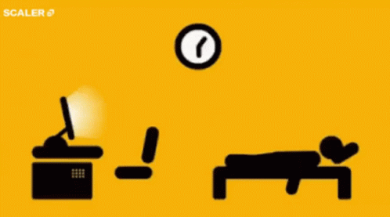

<h1 align="center">Hi 👋, I'm Sudarshan Devadiga</h1>
<h3 align="center">A passionate B.Tech Student from India</h3>

  

- 🌱 I’m currently learning **Data Structures & Algorithms**

- 💬 Ask me about **Anything**

- 📫 How to reach me **sudarshandevadiga200@gmail.com**

- ⚡ Fun fact **I am a Multi Sports Athlete**

<h3 align="left">Connect with me:</h3>

<h3 align="left">Languages and Tools:</h3>

        

<h3 align="left">Support:</h3>

  

&nbsp;

<picture>
  <source media="(prefers-color-scheme: dark)" srcset="https://raw.githubusercontent.com/tobiasmeyhoefer/tobiasmeyhoefer/output/github-snake-dark.svg" />
  <source media="(prefers-color-scheme: light)" srcset="https://raw.githubusercontent.com/tobiasmeyhoefer/tobiasmeyhoefer/output/github-snake.svg" />
  
</picture>

  

